# E-Commerce Customer Segmentation 

## Project Overview
This project analyzes transactional data from an e-commerce retail business to uncover revenue drivers, customer behavior patterns, and growth opportunities. Using Python for data cleaning and RFM (Recency, Frequency, Monetary) segmentation, customers were classified into strategic groups: **Champions, Loyal Customers, Frequent Buyers, and At Risk customers**  to better understand their value and purchasing habits.  

An interactive **Power BI dashboard** was created to visualize sales performance, customer segments, product trends, and geographic distribution, providing actionable insights for business growth.

---

## Dataset
- **Transactions:** 397884 records  
- **Unique Customers:** 4338  
- **Countries:** 37  
- **Date Range:** 2010-12-01 – 2011-12-09 
- **Total Revenue:** [Currency]8,911,407.90 
- **Source:** Online Retail Dataset  


---

## Project Structure
```
Ecommerce_Customer_Segmentation/
│
├── data/ # Raw and cleaned datasets
│ ├── raw/ # Original dataset
│ ├── cleaned/ # Cleaned dataset
│ └── customer_segments.csv # RFM segmentation results
├── notebooks/ # Python notebooks
│ ├── data_cleaning.ipynb
│ └── rfm_segmentation.ipynb
├── powerbi/ # Power BI dashboard file (.pbix)
├── reports/ # Report.md
├── assets/ # Images/screenshots
└── README.md # Project overview
```

---

## Workflow / Methodology
1. **Data Cleaning & Preprocessing:**  
   - Remove duplicates, canceled orders, and null values  
   - Calculate `TotalPrice = Quantity × UnitPrice`  

2. **Exploratory Data Analysis (EDA):**  
   - Total revenue 
   - Top countries by revenue  
   - Monthly sales trend 

3. **RFM Customer Segmentation:**  
   - Recency: Days since last purchase  
   - Frequency: Total number of purchases  
   - Monetary: Total spend  
   - Classify customers into **Champions, Loyal Customers, Frequent Buyers, At Risk, Others**  

4. **Power BI Dashboard Development:**  
   - Interactive visuals with KPI cards, line charts, bar charts, pie charts, maps, and tables  
   - Filters/slicers for Country, Month, Product, and Segment  

---

## Power BI Dashboard Pages
- **Page 1: Executive Overview** – Key metrics and high-level business overview  
- **Page 2: Sales Insights** – Revenue trends, and top countries  
- **Page 3: Customer Insights (RFM)** – RFM-based customer groups and revenue contribution  
- **Page 4: Product Insights** – Top products and sales trends  
- **Page 5: Geographic Insights** – Revenue and customer distribution by country  
- **Page 6: Key Insights & Recommendations** – Actionable strategies for business growth  

---

## Key Insights
- A small portion of high-value customers (Champions) contributes a **significant share of total revenue**.  
- Certain countries (United Kindom, Netherland) drive the majority of sales, highlighting **geographic opportunities**.  
- Top products (Paper craft, Regency cakestand 3 tier etc) generate the highest revenue, suggesting **priority items for marketing campaigns**.  
- At Risk customers (33.03%) represent an opportunity for **targeted retention campaigns**.


---

## Recommendations
- **Reward Champions:** Implement VIP programs and exclusive discounts  
- **Re-engage At Risk Customers:** Personalized promotions to reduce churn  
- **Promote Top Products:** Focus marketing campaigns on high-revenue products in top-performing countries  
- **Use Segmentation:** Optimize marketing strategies for different customer groups  

---

## Tools & Technologies
- Python (Pandas)
- Power BI (Interactive Dashboard)

---
## Power BI Screenshots
### Page 1 – Executive Overview
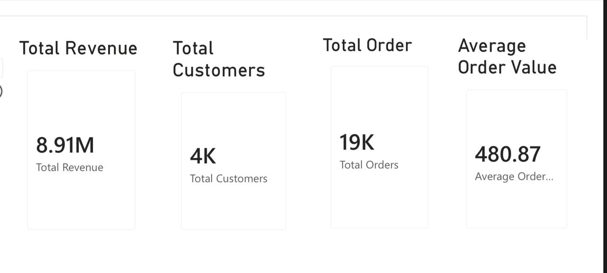
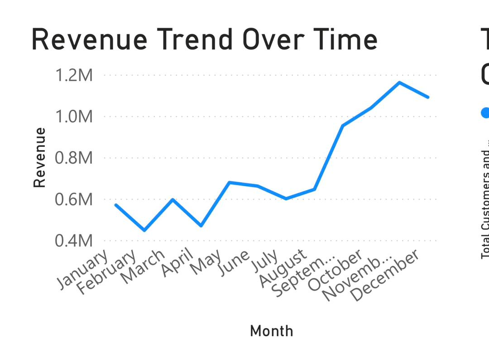
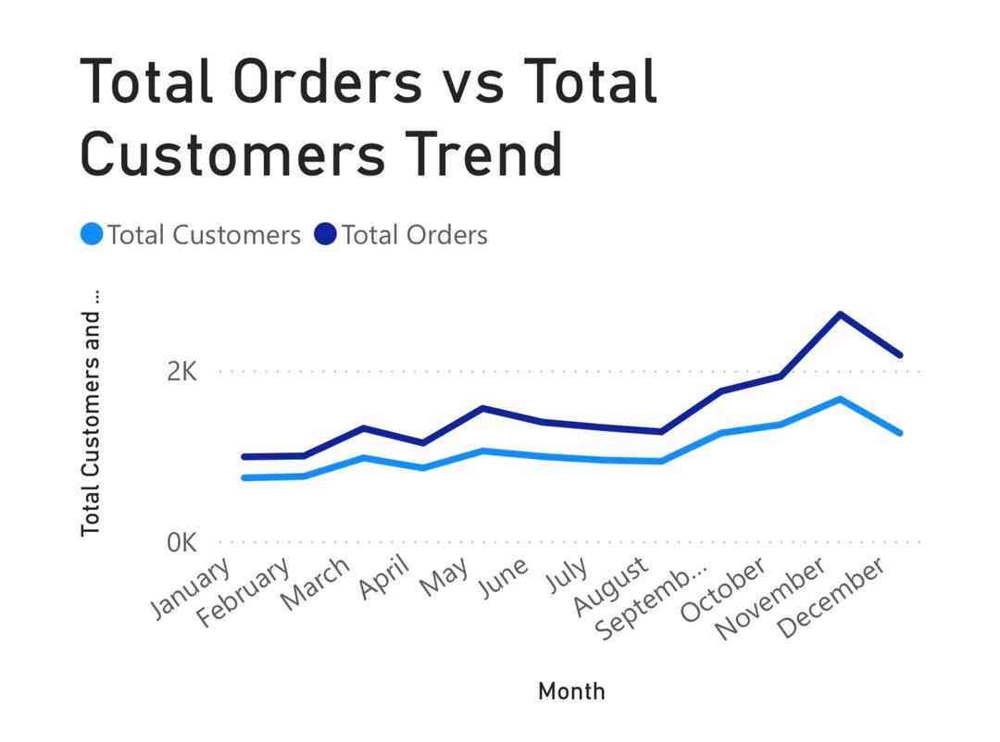
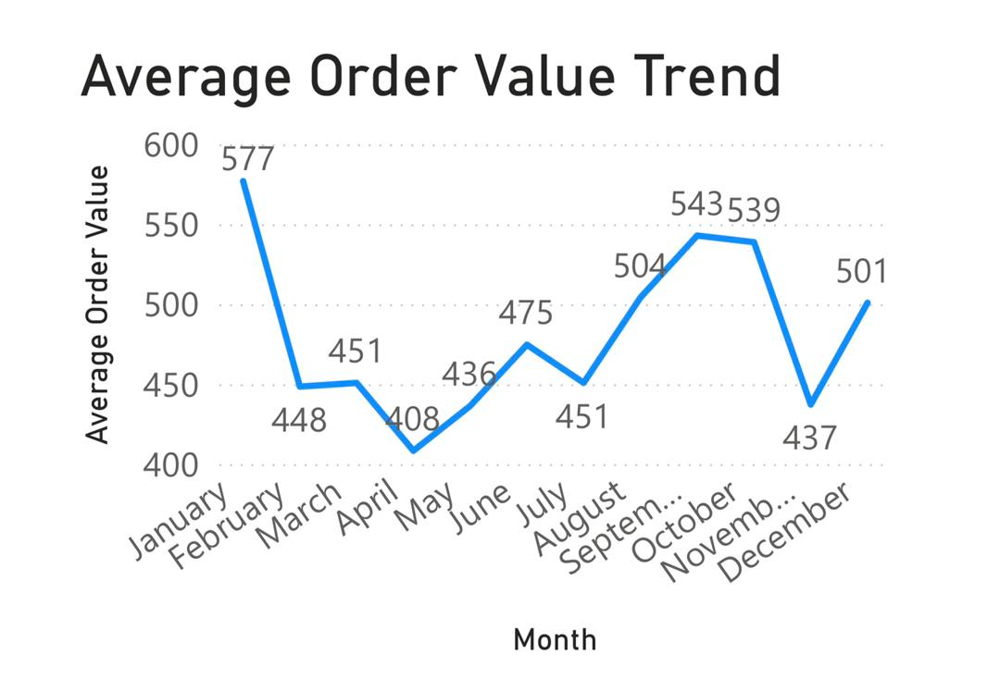

### Page 2 – Sales Insights
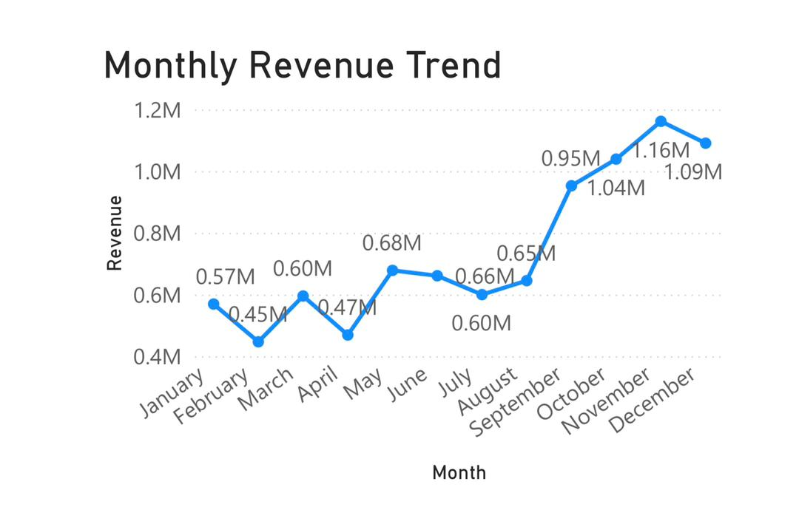
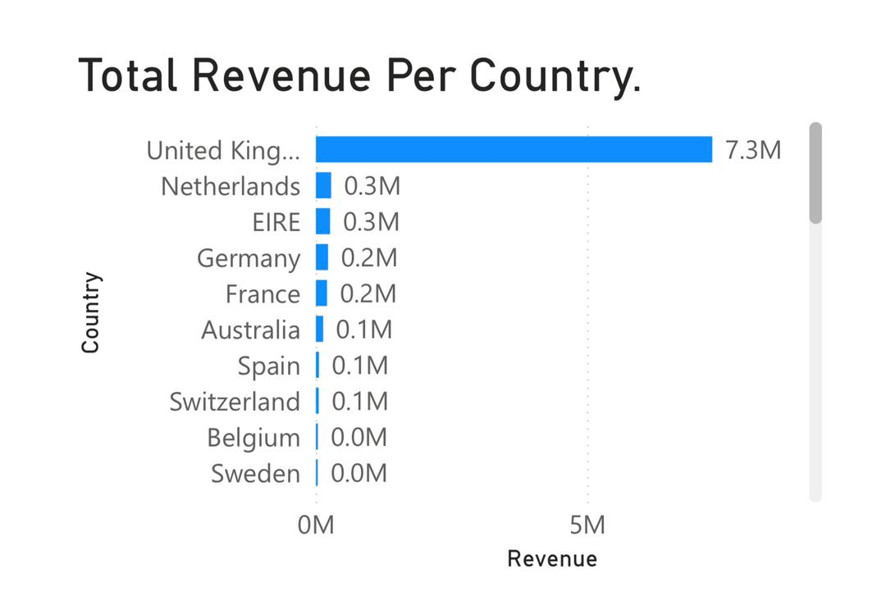

### Page 3 – Customer Insights (RFM)
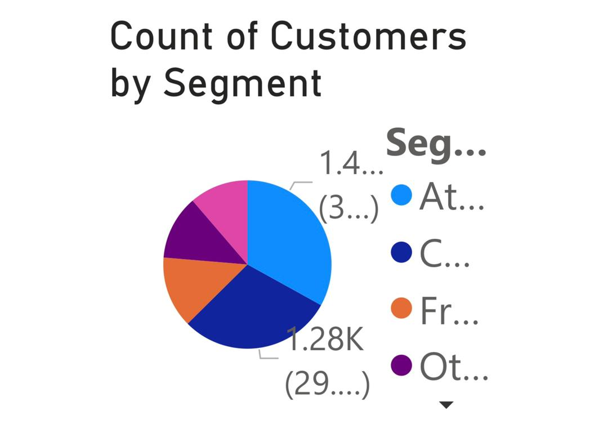
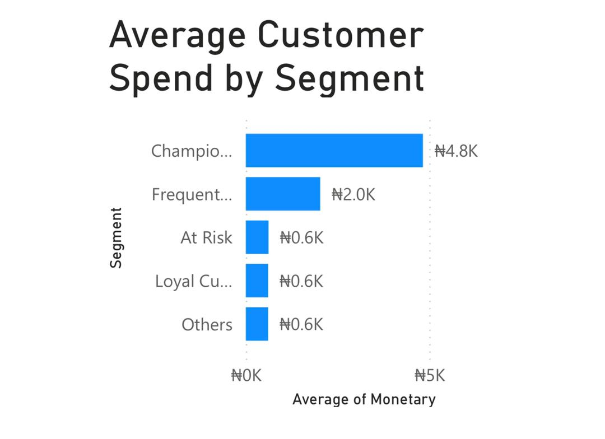
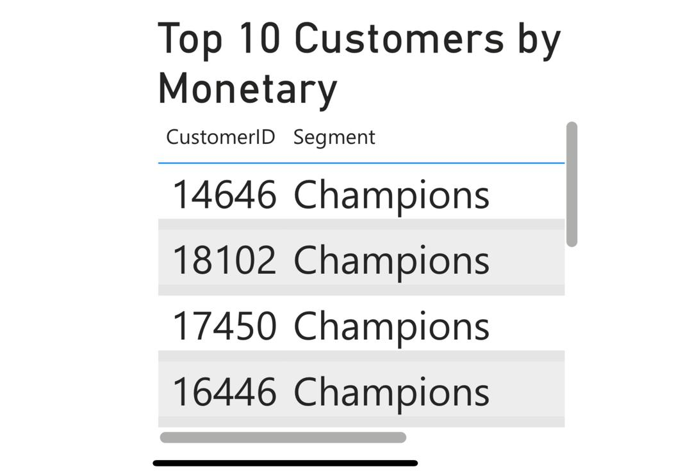

### Page 4 – Product Insights
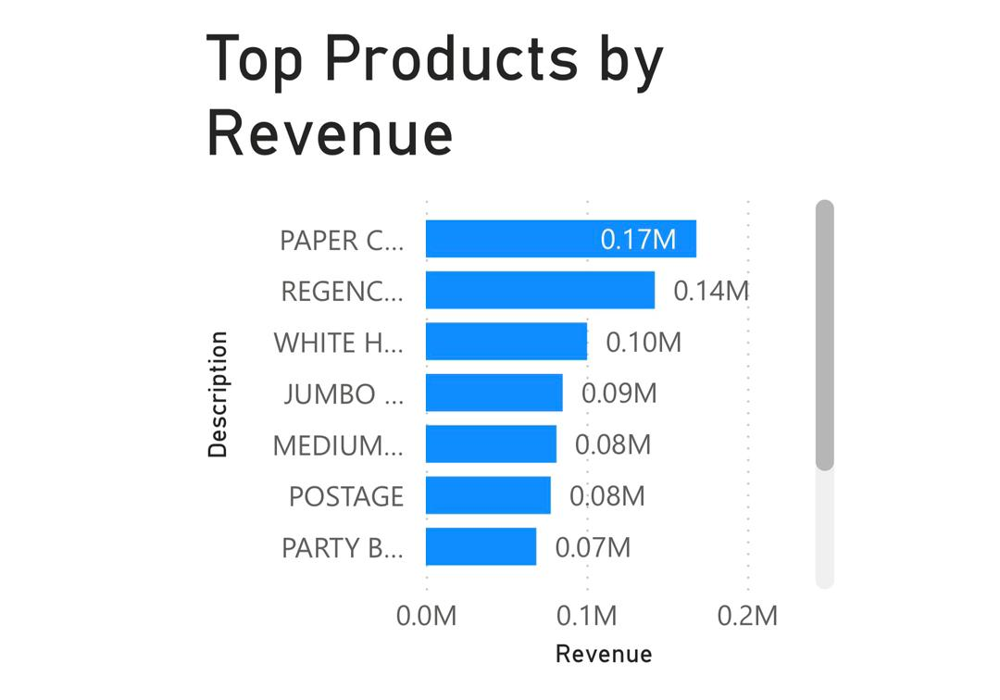
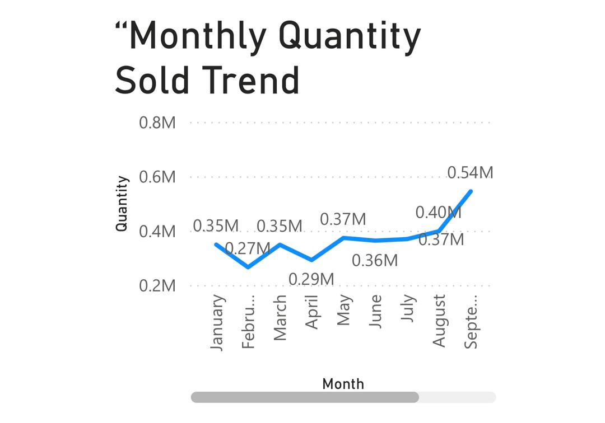

### Page 5 – Geographic Insights
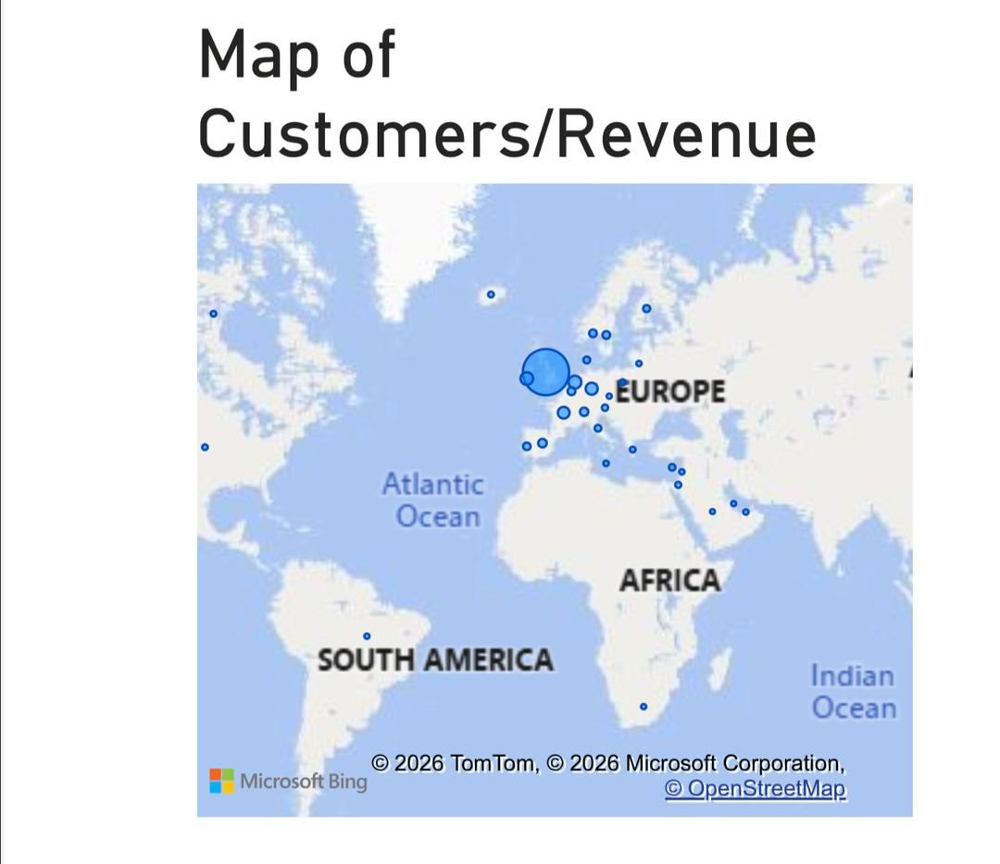
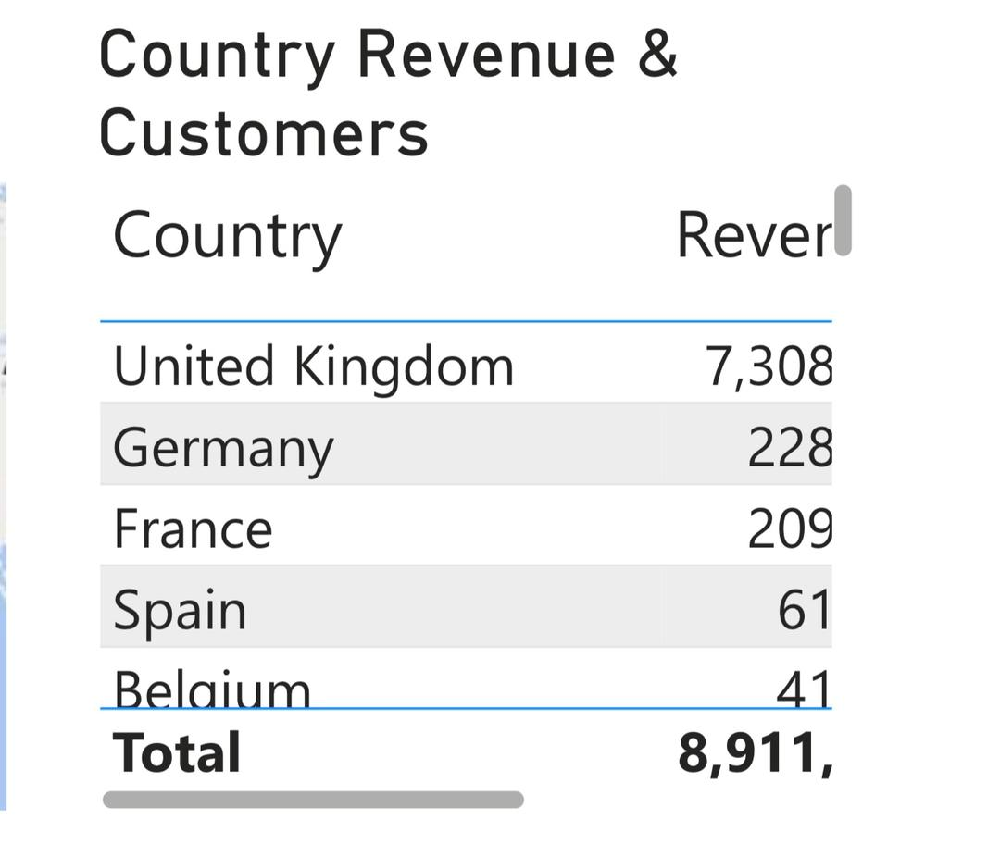

### Page 6 – Key Insights & Recommendations
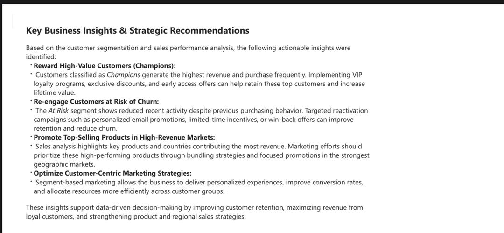

---

## How to Explore
1. Open notebooks in `notebooks/` to view Python analysis.  
2. Open `ecommerce_customer_segmentation_dashboard.pbix` in `powerbi/` to explore the interactive dashboard.  
3. View screenshots in `assets/images/` for a quick visual overview.  
4. Open `data/` to access the datasets for reproducing the analysis.
---

## Author
*Muktar Bello*  
*22 February 2026*

## License
MIT License
